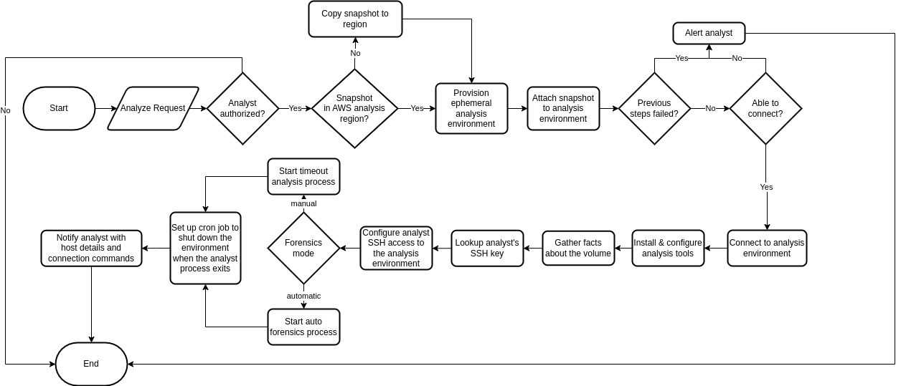

# AWS Snapshot Analysis

As an analyst, I want to have the ability to quickly spin up an environment for
doing AWS snapshot analysis, and automate the normal, repeatable steps.

## Goals:

* Set up an environment for analyzing compromised AWS snapshots
* Support both manual and automatic forensics
* Save results in an artifact repository for later access

## Playbook

### Requirements

This playbook will need access to:

* Resources to create an analysis environment
* Copy the snapshot to the analysis environment
* Pull ssh public keys for analyst access to the analysis environment
* Notify/alert analysts
* Write to an artifact repository

### Triggers

The playbook starts with a request that could come from a web hook, email,
survey, etc. depending on the capabilities of the SOAR platform and how your
team wants to trigger it.

Here are some example parameters for a trigger:

* `analyst_uid` - some identifier for the analyst who needs access
* `aws_analysis_region` - the region where the analysis will happen
* `aws_snapshot_region` - the region where the snapshot needs to be copied from
* `aws_snapshot_id` - the id of the snapshot to analyze
* `aws_ec2_instance_type` - which instance should the analysis env be built on
* `forensics_mode` - `automatic` or `manual`

### Steps

1. Receive analyze request
1. Check analyst authorization
1. If analyst is not authorized
    1. Exit early
1. Check if the snapshot exists in the AWS analysis region
1. If it does not, copy the snapshot into the AWS analysis region
1. Provision an ephemeral[1] analysis environment
1. Attach snapshot to the analysis environment
1. Validate previous steps
1. If previous steps failed
    1. Alert[2] the analyst
    1. Exit early
1. Check analysis environment connection
1. If unable to connect
    1. Alert[2] the analyst
    1. Exit early
1. Connect to the analysis environment
1. Install and configure analysis tools in the analysis environment
1. Gather facts about where the snapshot volume has been mounted
1. Lookup the analyst's SSH key
1. Configure the analyst's access to the host through their SSH key
1. Start an analysis process[3] on the host
    1. If forensics mode is automatic start auto forensics
    1. If forensics mode is manual start a wait process that acts as a timeout
1. Set up a cron job to shut down the environment when the analysis process
   exits
1. Notify the analyst that their host is ready[4]
1. Validate that the tools are installed and configured
1. If there was a failure
    1. Alert[2] the analyst
    1. Shut down the host
    1. Exit

At this point, the environment should be set up and the analyst should have what
they need to access the environment and analyze the snapshot or information on
how to connect to watch the auto forensics work on it. When the analysis is done, 
the results will need to be uploaded to the artifact repository since the
environment is ephemeral.

**Notes**

[1] When the environment shuts down, it should delete its resources.

[2] The alert should contain details about the environment, what failed, and
    any steps not handled by the automation to clean up the environment.

[3] The goal of this process is either to do work or act as a timeout for how
    long the analysis environment should exist. This helps avoid unused
    resources sitting around.

[4] The notification should have the host details in it, where the volume is
    mounted and example commands to connect to the host and how to shut it down
    early by killing the analyst process.

### Diagram


### Results

The results will heavily depend on the types of analysis.

Say, for example, that log2timeline was used, then things like the plaso db and
activity files would be uploaded to the artifact repository. For an incident
named `oops-2023` involving a snapshot named `snap-1234` it might look
like this:

```
oops-2023
└── snap-1234
    ├── nvme0n1p1.plaso
    ├── nvme0n1p1.activity
    ├── nvme0n1p2.plaso
    ├── nvme0n1pe.activity
    ├── analyst-notes.txt
    └── malware-sample-123.tar.gz
```

## Implementations

These are the currently documented implementations. Other implementations are
possible and may be added here over time.

### SOAR

The SOAR platform could be a single application or multiple ones communicating
with each other. Each section below covers a potential implementation.

#### Ansible Automation Platform

[Ansible Automation Platform](../../tools/ansible) in this
use case supports:

* Triggering via survey/form or web hook
* Emailing analysts via the `community.general.mail` module
* Secrets/config management
* Provisioning EC2 instances via the `amazon.aws` collection
* Copying snapshots via the `community.aws` collection
* Running adhoc commands in the analysis env
* Delete snapshots using a scheduled run that searches for snapshots outside
  of the retention period

### Analysis Environment

The analysis environment could be implemented in different ways, but basing it
off of an EC2 instance does provide some nice benefits since the snapshots
are already in AWS.

#### Container with Custom Code on an EC2 Instance

A [container](../../tools/containers) running on a stock Amazon EC2 instance is
a fairly straight forward way to set up an analysis env. The container would
contain all of the tools that the analysts need to do their work as well as the
forensics automation.

Example implementation:

* A stock EC2 instance is spun up and is set to terminate when shut down.
* A custom analyst-tools container is pulled onto the instance.
* The container is started with proper mounts and permissions in automatic
  forensics mode or with the sleep command to a timeout for how long a manual
  env should stay up. This would be the "analysis process" in the diagram
  above.
* A cron job is started that will shut down the host when the container stops
* The email from the SOAR platform tells the analyst how to connect to the
  container or kill it (which will tear down the host) or view the container
  logs if it was started in automatic forensics mode

### Artifact Repository

#### S3 Bucket

A private [S3 bucket](../../tools/amazon-s3) works well because it's simple to
provide EC2 instances access to the bucket when provisioning them. They are
also straightforward for analysts to access them via the `aws` CLI tool to pull
existing artifacts onto a manual environment after an automatic run has
finished, or to pull the artifacts locally for analysis with their own tools.
