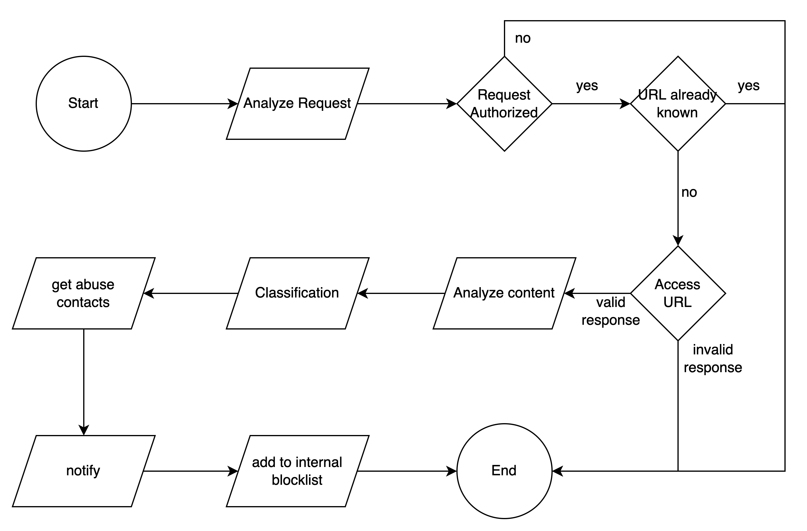

# Title: Malicious Domain Takedown

## Goals:
  * analyze reported URLs
  * check for malicious content
  * report URL/Domain for takedown

## Playbook
### Requirements
   * Analysis environment with no risk of infecting others
   * check if the reported Site is malicious
     * Phishing
     * Malware
     * Known bad patterns
   * report to the analyst
   * access for dns lookups, whois, asn

### Triggers
   The playbook starts with a request that could come from an automatic scanner, manual report, automatic report from an external partner

### Steps

1. receive analysis request
1. check request authorization
  1. if requester is not authorized, exit early
1. is the URL already known?
  1. exit early if URL is already known
1. access URL
  1. exit early if response is invalid (e.g., 404 not found)
1. Check response for
  * phishing content
  * known malware patterns
  * known bad patterns like modified javascript code
1. Classify URL
1. get abuse contact, ASN
1. send out notification
  * AS abuse contact
  * IP abuse contact
1. Add malicious URL to internal blocklists

### Diagram

### Results
  * take down request are sent, the domain will hopefully be made unavailable soon
  * internal users are protected via the blocklists

## Implementations

## SOAR
The SOAR platform could be single application or multiple ones communication with each other. Many of the steps can be automated

### URL already known
search in one or more data pools, blacklists or similar if the URL is already known as malicious

### access URL
Accessing the URL can also be an automated step. The tool should be able to download the source code and take a screenshot of the webpage. Screenshots are very valuable especially for phishing sites. A hash value about the source could be used to later check if the webpage content has changed or not.

### get abuse contacts
This step usually sends the IP of the server hosting the content to whois to get the AS abuse contact. Maybe you have other directories in your environment you want to include in this step as well.

### notify
sending out notifications can also be automated. Based on the analysts classification you want to inform different parties about your finding and send out take down requests to different parties (Hoster, AS abuse contact, Registry, other CERT/CSIRT teams, ...)

### add to blocklist
based on the result of the analysis, you want to add the URL to different internal or external blocklists. This step can also be automated based on the analysis result.

### Artifact Repository
  * Responses, hash values and screenshots might be stored for some time, to document the request and the outcome.
