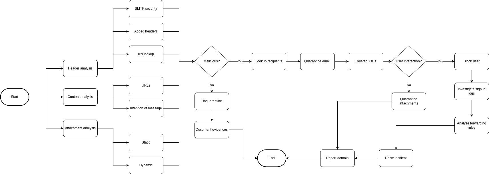

# Title: Potential phishing analysis

## Goals:
  * Conclude whether a reported email is a phishing mail or not
  * Identify user interactions with the email or its contents
  * Mitigate any potential compromise

## Playbook
### Requirements
   * URL analysis tools (DNS lookups, isolated environment)
   * Analysis environment for attachments
   * Logging of the message tracking
   * Logging of the users' navigation

### Triggers
   The playbook could start with a reported email from a user, from an alert 
   that might have triggered identifying any indicator (e.g. TI on sender's 
   domain) or through an email security service that hasn't mitigated the 
   potential threat.

### Steps

1. Identify potential phishing or receive reported email
1. Email analysis
  1. Header analysis
    1. Check SMTP's SPF, DKIM, DMARC
    1. Verify potentially added headers by the email provider (e.g. SCL, BCL)
    1. Verify IP addresses
  1. Content analysis
    1. Analyze URL if any
    1. Figure out intention (gather information, spam...)
  1. Attachment analysis
    1. Static analysis if possible (e.g. html)
    1. Dynamic analysis on an isolated environment
1. If malicious
  1. Lookup the users that received the email
  1. Quarantine email
  1. Lookup related IOCs (share them if possible)
    1. If anyone accessed the URL/domain lookup take proper actions
      1. Block user
      1. Investigate sign-in logs
      1. Analyse forwarding rules
      1. Raise an incident for deeper analysis
    1. Quarantine attachments
      1. If someone has run the attachment raise an incident for deeper analysis
  1. Report to the sender domain contact or URL domain owner if looks like it's 
  a compromised site
1. If legit
  1. Unquarantine in case it was quarantined or moved to spam
  1. Document the evidences found

### Diagram

### Results
  * Verify the legitness of the email
  * Mitigate any potential threat related to the email
  * Share and add to blocklists IOCs

## Implementations

### SOAR

The SOAR platform could be a single application or multiple ones communicating
with each other. Each section below covers a potential implementation.

### CAPEv2
CAPEv2 is a powerful tool to obtain configuration ifnormation and payload 
extraction from malware. It might help to identify malware families or gather 
further IOCs.

### M365 

#### Lookup recipients
M365 has some cmdlets that come in handy to lookup for recipients of emails. 
Here's an example to lookup for specific keyboards on one mailbox:

Search-Mailbox -Identity "Jane Smith" -SearchQuery "Subject:Invoice" 
-TargetMailbox "IRMailbox" -TargetFolder "Investigation" LogLevel Full

#### Check created inbox rules
Similar to the previous one, you can use the Unified AuditLog to search for 
inbox rules as follows:

Search-UnifiedAuditLog -StartDate 12/16/2021 -EndDate 03/16/2022 
-ResultSize 5000 -RecordType exchangeadmin -Operations New-InboxRule 
| Export-csv NoTypeInformation -Path c:\temp\Inboxrulesoutput.csv

## Artifact Repository
  * During the investigation, all the evidences for each step should be gathered
   and stored within the same thread of analysis (ticketing, playbook, etc.)

