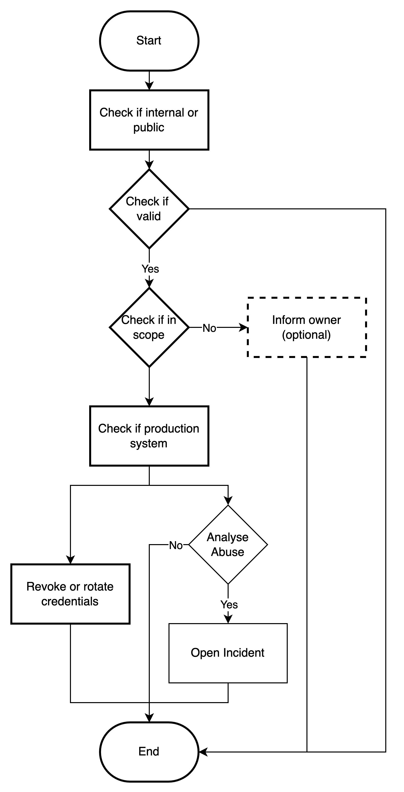

# Title: Leaked credentials

## Goals

* Identify the source of the leak
* Identify the impact of the leak
* Revoke and rotate leaked credentials
* Mitigate any potential compromise

## Playbook

### Requirements

* Credentials scanning system (optional)
* System inventory

### Triggers

Credentials can be leaked in many ways, any so a scanning system that looks for leaked credentials can provide value to
a response team in detecting a leak early. Also, a user reporting a leak can be a trigger.

### Steps

1. Identify and document the leaked credentials and their context
    1. Check if the leaked credentials are in an internal or public repository
    2. Check if the leaked credentials are still valid
    3. Check if the leaked credentials belong to the scope of the response team
        1. If not, notify the owner of the credentials
    4. Check if the leaked credentials are used in production systems
    5. Document systems and users that use the leaked credentials
2. Revoke or rotate the leaked credentials, include systems owners if needed
3. Analyse if the leaked credentials were abused
    1. Investigate the time between the leak and the revocation for any abuse
    2. If the leaked credentials were abused, identify the impact
        1. If the impact is relevant, raise an incident for deeper analysis
        2. If the impact is not relevant, document the abuse

### Diagram

### Results

* Credentials are revoked or rotated
* Systems owners are notified
* Systems are checked for abuse

## Implementations

## GitHub and GitLab

GitHub and GitLab have a feature that allows to scan for leaked credentials in repositories, or even prevent them from
being pushed to the repository.

## TruffleHog

TruffleHog is a tool that scans for secrets in various places, including git repositories and commit history. It can be
used to scan for leaked credentials, validation and manage their revocation.

## Other tools

* [LeakTK](https://github.com/leaktk/leaktk)
* [GitLeak](https://github.com/gitleak/gitleak)
  
